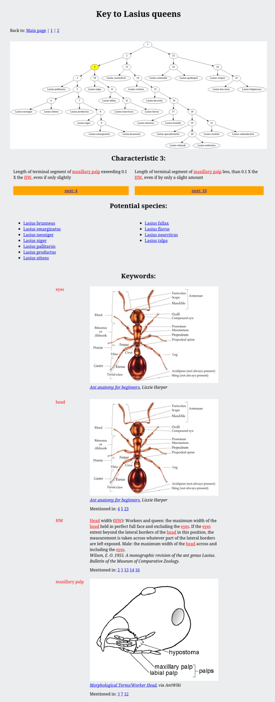

# tree-page-generator

Generate static pages containing tree hierarchies based on defined model.


## Examples

In `/examples` there are few examples of how to use the tool and what are results.

[](examples/key_ant_queen_lasius_wilson/screens/3-page.png)


## Running

[There](doc/cmdargs.md) is description of command line arguments.

To run application simply execute followoing command:
```
python3 -m treepagegenerator.main generate --data <apth-to-model> --outdir <path-to-output-dir>
```


## Model definition

Model consists of JSON file with predefined structure.

There are examples of model files placed under `./examples` directory.


## Installation

Installation of package can be done by:
 - to install package from downloaded ZIP file execute: `pip3 install --user -I file:tree-page-generator-master.zip#subdirectory=src`
 - to install package directly from GitHub execute: `pip3 install --user -I git+https://github.com/anetczuk/tree-page-generator.git#subdirectory=src`
 - uninstall: `pip3 uninstall treepagegenerator`

Installation for development:
 - `install-deps.sh` to install package dependencies only (`requirements.txt`)
 - `install-package.sh` to install package in standard way through `pip` (with dependencies)
 - `install-devel.sh` to install package in developer mode using `pip` (with dependencies)


## Development

All tests, linters and content generators can be executed by simple script `./process-all.sh`.

Unit tests are executed by `./src/testtreepagegenerator/runtests.py`.

Code linters can be run by `./tools/checkall.sh`.


## License

BSD 3-Clause License

Copyright (c) 2024, Arkadiusz Netczuk <dev.arnet@gmail.com>

Redistribution and use in source and binary forms, with or without
modification, are permitted provided that the following conditions are met:

1. Redistributions of source code must retain the above copyright notice, this
   list of conditions and the following disclaimer.

2. Redistributions in binary form must reproduce the above copyright notice,
   this list of conditions and the following disclaimer in the documentation
   and/or other materials provided with the distribution.

3. Neither the name of the copyright holder nor the names of its
   contributors may be used to endorse or promote products derived from
   this software without specific prior written permission.

THIS SOFTWARE IS PROVIDED BY THE COPYRIGHT HOLDERS AND CONTRIBUTORS "AS IS"
AND ANY EXPRESS OR IMPLIED WARRANTIES, INCLUDING, BUT NOT LIMITED TO, THE
IMPLIED WARRANTIES OF MERCHANTABILITY AND FITNESS FOR A PARTICULAR PURPOSE ARE
DISCLAIMED. IN NO EVENT SHALL THE COPYRIGHT HOLDER OR CONTRIBUTORS BE LIABLE
FOR ANY DIRECT, INDIRECT, INCIDENTAL, SPECIAL, EXEMPLARY, OR CONSEQUENTIAL
DAMAGES (INCLUDING, BUT NOT LIMITED TO, PROCUREMENT OF SUBSTITUTE GOODS OR
SERVICES; LOSS OF USE, DATA, OR PROFITS; OR BUSINESS INTERRUPTION) HOWEVER
CAUSED AND ON ANY THEORY OF LIABILITY, WHETHER IN CONTRACT, STRICT LIABILITY,
OR TORT (INCLUDING NEGLIGENCE OR OTHERWISE) ARISING IN ANY WAY OUT OF THE USE
OF THIS SOFTWARE, EVEN IF ADVISED OF THE POSSIBILITY OF SUCH DAMAGE.
